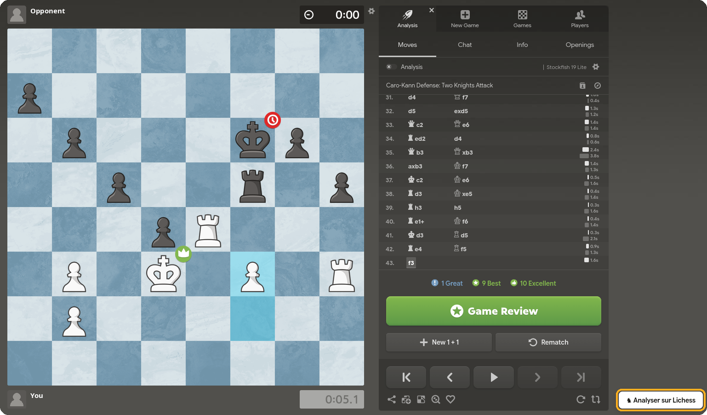

# Chess.com → Lichess

A Firefox extension that sends a Chess.com game to Lichess analysis in one click.



On any Chess.com game page, a **♞ Analyser sur Lichess** button appears in the bottom-right corner. Clicking it:

1. grabs the game's PGN,
2. imports it into Lichess (`lichess.org/api/import`, no account needed),
3. opens the Lichess analysis in a new tab, oriented from your side of the board.

Clicking the extension's toolbar icon does the same thing.

## How the PGN is retrieved

- **Default:** the extension opens Chess.com's *Share → PGN* dialog in the background, reads the PGN, and closes it again. This works right after the game ends.
- **Fallback:** if that fails, it searches Chess.com's public monthly archive (`api.chess.com/pub/player/{user}/games/{YYYY}/{MM}`) for the game. A game can take a few seconds to appear there.

Supported URLs: `chess.com/game/live/{id}`, `chess.com/game/daily/{id}`, `chess.com/game/{id}`, `chess.com/analysis/game/...`.

## Install

**Temporary (for development):**

1. Open `about:debugging#/runtime/this-firefox`
2. Click **Load Temporary Add-on…** and select `manifest.json`

The extension is removed when Firefox closes.

**Permanent:** Firefox only keeps signed extensions. You can sign it for free as unlisted (private) on addons.mozilla.org:

```sh
npx web-ext sign --channel=unlisted --api-key=... --api-secret=...
```

Get the API keys from addons.mozilla.org → Developer Hub → *Manage API Keys*, then install the generated `.xpi`. Another option: Firefox Developer Edition / Nightly with `xpinstall.signatures.required = false` in `about:config`.

## Files

| File | Role |
| --- | --- |
| `manifest.json` | Extension config (Manifest V2) |
| `background.js` | Fallback PGN lookup via the archive API, Lichess import, opening the tab |
| `content.js` / `content.css` | Button, notifications, reading the PGN from the Share dialog |
| `icon.svg` | Icon |

## Limitations

- Lichess rate-limits imports. If you click too often, wait a minute.
- Reading the Share dialog depends on Chess.com's page structure. If they change it, the extension falls back to the archive API.

## Credits

Built with [Claude Code](https://claude.com/claude-code) (Anthropic's Claude).
